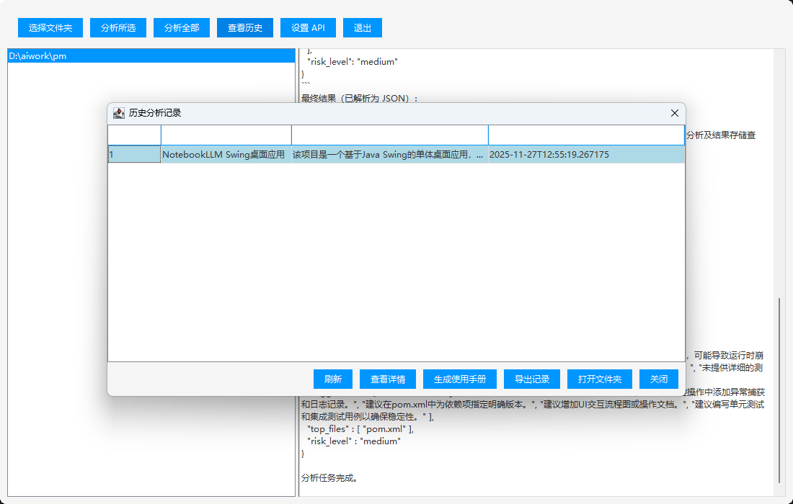
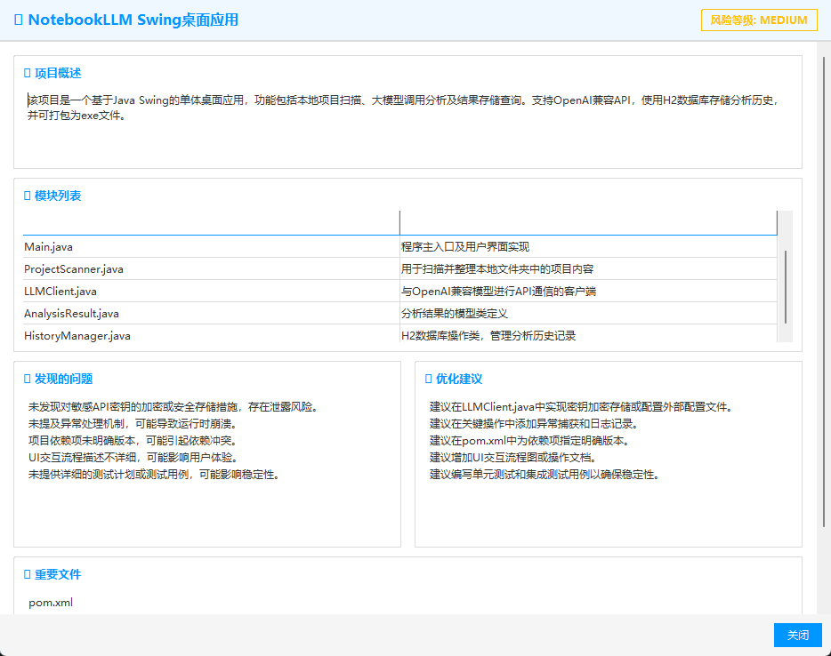
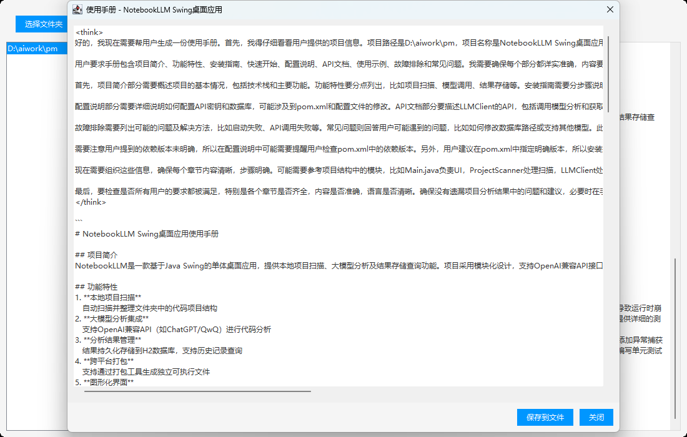

# NotebookLLM Swing

一个参考 Google NotebookLM 的 Java Swing 单体桌面应用。用于扫描本地的项目,快速生成项目结构分析报告。用于大模型善后服务...

## 功能
- 选择本地文件夹，自动递归扫描所有项目（支持多层级 Java/AI 项目）
- 展示项目列表，支持单个或批量分析
- 自动整理项目内容，调用 OpenAI 兼容大模型（如 ChatGPT、Qwen、ChatGLM）分析项目
- 分析结果本地展示，支持历史记录查询
- 使用 H2 数据库存储分析历史和结果
- 一键打包成可执行 exe文件

## 依赖
- JDK 17+
- Maven
- Swing（JDK自带）
- OkHttp（HTTP请求）
- Jackson（JSON处理）
- H2（嵌入式数据库）

## 快速开始
1. 安装 JDK 17+ 和 Maven
2. 配置 OpenAI 兼容 API 地址和 Key
3. 可在工作桌面配置（也可在 LLMClient.java 里修改）
4. 编译并运行：
   ```sh
   mvn package
   mvn exec:java
   ```

## 目录结构
```
src/main/java/com/example/notebookllm/
  Main.java            // 主入口+UI
  ProjectScanner.java  // 项目扫描
  LLMClient.java       // 大模型API调用
  AnalysisResult.java  // 分析结果模型
  HistoryManager.java  // H2数据库操作
```

## 配置说明
- 默认使用 H2 数据库文件 `notebookllm_history.mv.db`，无需额外安装。
- OpenAI 兼容模型 API 地址和 Key 可在 `LLMClient.java` 构造参数中设置。

## 运行效果
- 启动后可选择文件夹，自动扫描并展示项目列表。
- 选择项目后可一键分析，结果自动保存并可随时查询历史。
- 首页


- 大模型扫描页


- 运行结果页面


- 分析详情页面


- 用户手册页面

---
如需定制模型或功能，请联系开发者。
